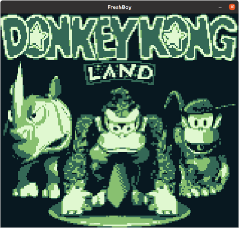

# FreshBoy

FreshBoy is a Game Boy (DMG) emulator written in modern C++.

The project started as a way to explore new features in C++20.  
It turned out to be a great way to combine my passion for embedded
systems programming with a splash of 90s nostalgia.

### Design goals

- Maximize code readability.
- Use modern C++20 features.
- No external dependencies in core library.
- Decoupled audio / video subsystem.
- Cross-platform.

### Features

- Full audio / video emulation with good performance.
- Supports ROM, MBC1 and MBC3 + RTC cartridges.
- RAM persistence (save data).
- Multiple color palettes.
- Original DMG boot ROM.
- Freestanding core emulator library with its own API.
  - No dependencies on other libraries, only standard C++.
  - Easy to replace SDL2 with another media library.
- Lightweight C++ wrapper library on top of native SDL2.
- Accurate CPU emulation, passes blargg's cpu_instrs tests.
- Accurate PPU emulation, passes dmg-acid2 tests.
- Accurate APU emulation, passes (most of) blargg's dmg_sound tests.

### Build instructions

#### Ubuntu 21.04
``` shell
$ sudo apt install build-essential cmake libsdl2-dev
$ ./install
```

### Keymap

|  Game Boy   |   FreshBoy   |
|:-----------:|:------------:|
|      A      |      X       |
|      B      |      Z       |
|    Start    |    Return    |
|   Select    |  Backspace   |
|     Up      |      Up      |
|    Down     |     Down     |
|    Left     |     Left     |
|    Right    |    Right     |

#### Color palettes

Press C to cycle between the available color palettes.

### Screenshots

#### Roms

 

 

 

#### Tests

 

 
